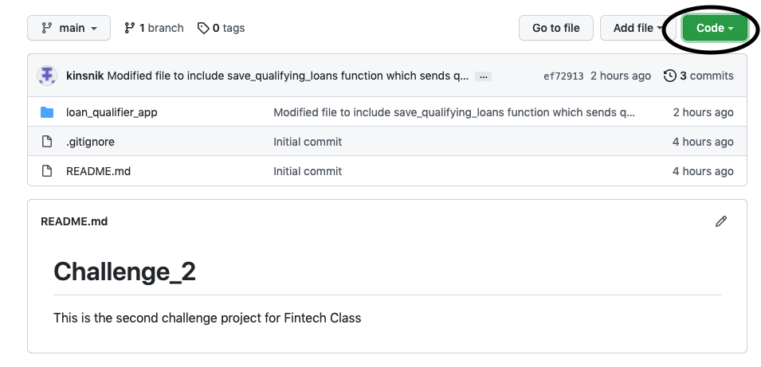
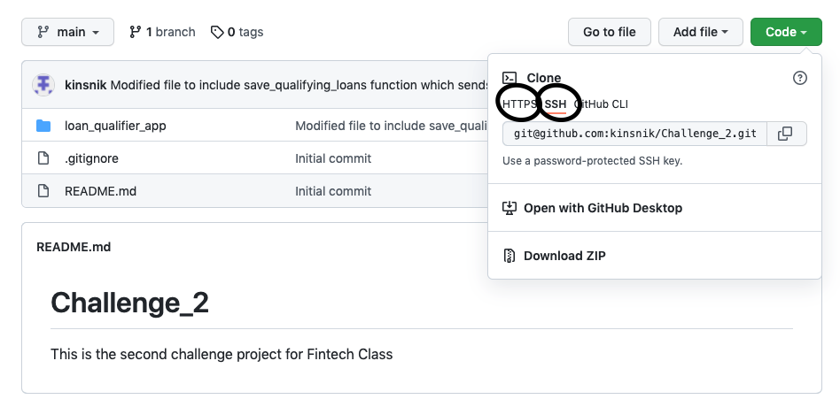
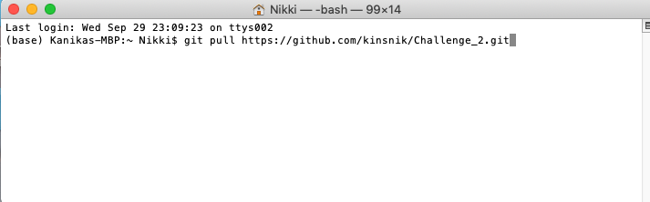
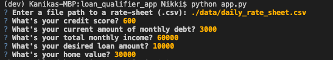
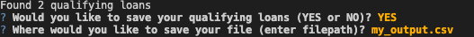

# **Loan Qualifier Application**

This purpose of this project is to develop an application that allows users to interact with the app to determine whether or not they are eligible for a loan and the details of the bank(s) that will allow them to take out a loan. Further, if the user wishes, it outputs a list of those banks and corresponding data to a csv file. 

In short, the app gives the user "the ability to save the qualifying loans to a CSV file so that they can share the results as a spreadsheet."

This will efficiently and quickly allow users who are looking to take out a loan to identify the banks (if they qualify for at least one loan) that will provide them with the loan and the interest rate of the loan based on the user's financials. 

---

## **Technologies**

This program is written in python and uses the following libraries: pathlib (specifically the Path function), csv, sys, fire and questionary. 

To run this application, there are multiple different functions running within the app some using modular programming to allow for an organized primary app. 
The modules that the app is dependent on is qualifier which contains the following sub-modules: 
* filters (which determine the user's loan eligibility based on their financials eg. credit score)
* utils (which in turn contains 1. calculators for financial ratios and 2. fileio, a file that handles file input and output). 
The output in utils is the csv file created by the save_csv function in the updated fileio module, which we modularized as follows:

```python

    def save_csv(csvpath, list_of_lists, header):

        with open(csvpath, 'w', newline='') as csvfile:
        csvwriter = csv.writer(csvfile)
        csvwriter.writerow(header)
        
            for list in list_of_lists:
            csvwriter.writerow(list)
```

---

## **Installation Guide**

1. First you would want to navigate to GitHub to the Challenge_2 repository and click on the green Code button which allows you to clone the repository. 


2. Once clicking on either SSH or HTTPS as a clone method, it automatically copies the link. You will then navigate to the Terminal or GitBash and type 
git clone (paste ssh/https for Challenge_2 repo) and run the command. 


3. Once complete, you can use the "git pull" command in Terminal or GitBash to pull the repository from the remote repository to a local directory of your choice. 


4. Now you should have access to the application (app.py) as well as other files within the repository upon which app.py depends for the functions. 

---

## **Usage**

1. Upon installing app.py and other files by pulling the repo, you would want to navigate to the Terminal or Git Bash and run the following command: 
python app.py
2. Follow the Command Line Interface prompts to enter the data requested: file path to the daily_rate_sheet, credit score, debt, income, loan amount and home value. 


3. The app will calculate your debt-to-income ratio, your loan-to-value ratio, and the number of loans you qualify for.
4. If you don't qualify for any loans, the application will notify you as such before exiting:
Sorry! You have no qualifying loans. :(
5. If you qualify for a loan(s) you have the option to save the details of the bank(s) willing to lend in a csv file.
6. If you select YES, then it will prompt you to choose a filename where you would like to save the details of the banks willing to lend. 


7. If you select an invalid filename, the application will notify you as such before exiting:
Oops! Can't find this path: "path you entered"
8. If you select NO, then the application will exit immediately.

---

## **Contributors**

The author of this application is Kanika Sharma with Github username kinsnik, who also goes by Niki. She can be reached at ksharmaconnect3@gmail.com or on LinkedIn under Kanika Sharma: https://www.linkedin.com/in/kanika-sharma-aa28a6134/.

---

## **License**

Users have permissions to read this file, but not write or edit the code. The code within, if used, should be properly recognized and cited as the intellectual property of the author. 